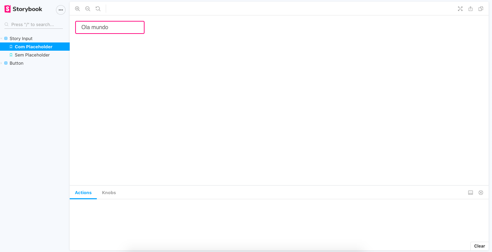
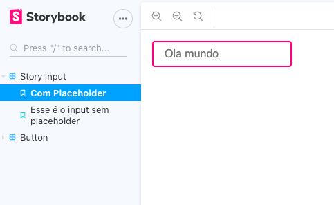
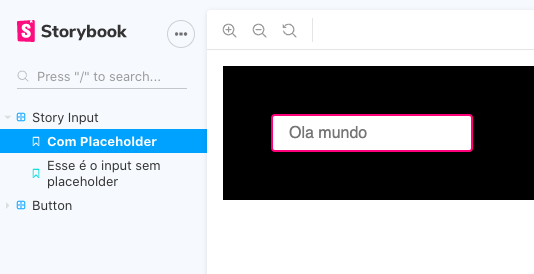

# Vue.js e Storybook
[](doc/vuestory.png "Tela do Storybook")

> Criando, visualizando e publicando componentes Vue.js no NPM com o Storybook

## O que é o Storybook?

<center>
  
</center>


[Storybook](https://storybook.js.org/) é uma ferramenta Open Source que ajuda a desenvolver componentes de interface de forma isolada, ou seja, com o uso do Storybook é possível trabalhar em apenas um componente por vez, abstraindo qualquer stack complexa, e testá-los sem a necessidade de navegar entre telas.

Atualmente ele tem suporte oficial para o [Vue.js](https://vuejs.org/), [React](https://pt-br.reactjs.org/), [Angular](https://angular.io/) e [Web components](https://www.webcomponents.org/), porém também algumas tecnologias são suportadas pela comunidade, entre eles temos: [Ember](https://emberjs.com/), [Svelte](https://svelte.dev/), [Rax](https://rax.js.org/), [Preact](https://preactjs.com/), [Marko](https://markojs.com/) e o próprio HTML.

O Storybook usa o que é chamado de ["stories"](https://storybook.js.org/docs/vue/get-started/whats-a-story) para renderizar cada componente em um canvas, onde é possivel iteragir livremente com seu componente de UI, por padrão ele já vem configurado com [HMR](https://webpack.js.org/concepts/hot-module-replacement/), ou seja, você não precisa recarregar a página sempre que realiza alguma alteração. 

## Como usar no seu projeto Vue?

Antes de tudo inicie seu projeto com o [Vue CLI](https://cli.vuejs.org/guide/installation.html) (Nesse exemplo estou usando a versão 2.x).
```properties
foo@bar:~$ vue create nome-do-projeto
```

Com o projeto incializado é possível adicionar o Storybook com o próprio Vue CLI:
```properties
foo@bar:~$ vue add storybook
```

Após finalizar essa operação é possível observar que foi criado uma pasta `config/storybook`, onde podemos manipular as configurações do Storybook, além disso foi adicionado o diretório `src/stories`, com um arquivo `index.stories.js`, se olharmos novamente no `config/storybook` é possível notar que o arquivo `main.js` classifica todos os arquivos com a extensão `**.stories.js` como as stories que serão usadas para renderizar o componente, por fim mas não menos importante foi adicionado dois scripts ao nosso `package.json`, `storybook:build` e `storybook:serve` e um componente `MyButton.vue` como exemplo.


### Explorando stories

Rodando o comando `yarn storybook:serve` o Storybook abre uma nova aba na porta 6006, onde é possível ver no canto direito as variantes do MyButton e iteragir com ele via canvas.

Abrindo o `index.stories.js` podemos ver que ele exporta 3 constantes, cada uma com uma variação do MyButton, é possível tanto exportar via template string, como via JSX, a fim de familiaridade com o Vue.js iremos usar apelas o modo de template string nesse tutorial.

### Escrevendo histórias

Agora vamos escrever nossa primeira história, vamos criar um input que iremos chamar de `StoryInput`.

**src/components/StoryInput.vue**
```vue
<template>
    <div>
        <input type="text" class="storybutton" :placeholder="placeholder">
    </div>
</template>
<script>
export default {
    props: {
        placeholder: String
    }
}
</script>

<style scoped>
.storybutton {
    outline: none;
    border: 2px solid rgb(255, 12, 128);
    padding: 0.5rem 1rem;
    border-radius: 0.25rem;
    font-size: 1rem;
    font-family: sans-serif;
    transition: all 500ms linear;
}

.storybutton:hover {
    border-color: rgb(21, 176, 23);
}
</style>
```


Vamos criar um arquivo `StoryInput.stories.js`, basta importar o componente Vue, e exportar como default um objeto com o nome que você deseja que apareca na sua lista de stories e o componente, após isso basta exportar n constantes com cada variante do objeto, no caso exportamos tanto uma variante com placeholder, como uma sem placeholder.

[](doc/screen1.png "Tela do Storybook")

### Configurações avançadas de visualização

Voce deve ter notado que os nomes que aparece nas suas stories, são baseados no nome da variável exportada.

```js
export const semPlaceholder = () => ({
    components: {StoryInput},
    template: '<story-input />'
})
```

Porém e se por algum motivo temos que adicionar caracteres que são ilegais para variáveis no nome da story? Podemos fazer isso sobreescrevendo as propriedades do Story:

```js
semPlaceholder.story = {name: "Esse é o input sem placeholder"}
```

Agora o nome da nossa story é `Esse é o input sem placeholder`

[](doc/screen2.png "Nome da story sobreescrito")


### Decorators

Decorators permite que envolvamos nossa story com elementos HTML, sem necessáriamente alterar o component, isso abre um leque de oportunidades, **e.g.** alterar a cor de fundo e adicionar margin/padding. 

Basta adicionar a propriedade `decorators` ao export default da story da seguinte forma:

```javascript
export default {
    title: 'Story Input',
    component: StoryInput,
    decorators: [() => "<div style='padding: 3rem; background: #000'><story/></div>"]
}
```

[](doc/screen3.png "Com decorators")

A tag `<story/>` é **obrigatória**, sem ela é impossível renderizar nosso componente, também existe a posibilidade de adicionar o decorator individualmente sobreescrevendo a propriedade story:

```javascript
semPlaceholder.story = {name: "Esse é o input sem placeholder", decorators: [() => "<div style='padding: 3rem; background: #000'><story/></div>"]}
```

## Publicando seu componente Vue no NPM

Publicar um componente Vue no NPM pode parecer uma tarefa complexa mas é mais simples do que parece, antes de tudo você precisa criar uma conta no NPM em https://www.npmjs.com e realizar o login via linha de comando.

```properties
foo@bar:~$ npm login
```

Após isso, vamos configurar para que o VueJS não faça a extração do CSS, por que isso? Porque se não o fizermos, todo o estilo que foi escrito no nosso componente será extraido e ignorado quando instalado em outros projetos, basta criar na raiz do projeto um arquivo `vue.config.js` e incluir o seguinte código:

```js
module.exports = {
    css: { extract: false }
}
```
Para que nosso componente possa ser amplamente usado devemos publicar ele no NPM como um módulo CommonJS/UMD, para isso vamos criar um arquivo `src/index.js` que cuidará da exportação e a instalação automática do módulo CommonJS/UMD.

```js
// Importa o componente
import component from  './components/StoryInput.vue';

// Declara a função de instalação executada pelo Vue.use()
export function install(Vue) {
  if (install.installed) return;
  install.installed = true;
  Vue.component('StoryInput', component);
}

// Cria a definição do módulo para Vue.use()
const plugin = {
  install,
};

// Auto-instala quando o Vue é encontrado (no navegador via <script>)
let GlobalVue = null;
if (typeof window !== 'undefined') {
  GlobalVue = window.Vue;
} else if (typeof global !== 'undefined') {
  GlobalVue = global.Vue;
}
if (GlobalVue) {
  GlobalVue.use(plugin);
}

// Para permitir o uso como um módulo exportável (npm/webpack/etc.)
export default component;
```

Agora o só falta editar o package.json, fazer o build e publicar no NPM, para isso adicione as seguintes informações ao `package.json`
``` json
  "main": "./dist/vuejs-storybook-input.common.js",
  "scripts": {
    "serve": "vue-cli-service serve",
    "build": "vue-cli-service build",
    "lint": "vue-cli-service lint",
    "storybook:build": "vue-cli-service storybook:build -c config/storybook",
    "storybook:serve": "vue-cli-service storybook:serve -p 6006 -c config/storybook",
    "build:npm": "vue-cli-service build --target lib --name vuejs-storybook-input ./src/index.js"
  },
  "files": [
    "dist/*"
  ],
```
**Além disso remova a propriedade `private`, ou mude de true para false**

o `vuejs-storybook-input` é totalmente moldável para nome que você escolher para seu pacote, nesse exemplo vamos utilizar o próprio.

Note que adicionamos um endereço para o atributo **main**, isso mostrará para o NPM qual é o arquivo padrão que deve ser incorporado nos imports, além disso adicionamos o atributo **files**, ele mostra quais são os diretórios que queremos enviar para o NPM, no caso apenas o `dist/` e por fim temos a inserção do script **build:npm** que compilará nosso Single-File Component para um módulo CommonJS/UMD.

Basta rodar o comando

```properties
foo@bar:~$ yarn build:npm && npm publish
```

Pronto, seu componente está disponível no NPM!!


### Como usar o componente em 3 passos:

Irei demonstrar agora como utilizar esse componente em outro projeto


1. Crie um novo projeto vue

```properties
foo@bar:~$ vue create sample
```

2. Instale seu pacote

```properties
foo@bar:~$ yarn add vuejs-storybook-input
```

3. Importe e registre o componente

```vue
<script>
import StoryInput from 'vuejs-storybook-input'
export default {
  components: {
    StoryInput
  }
}
</script>
```
